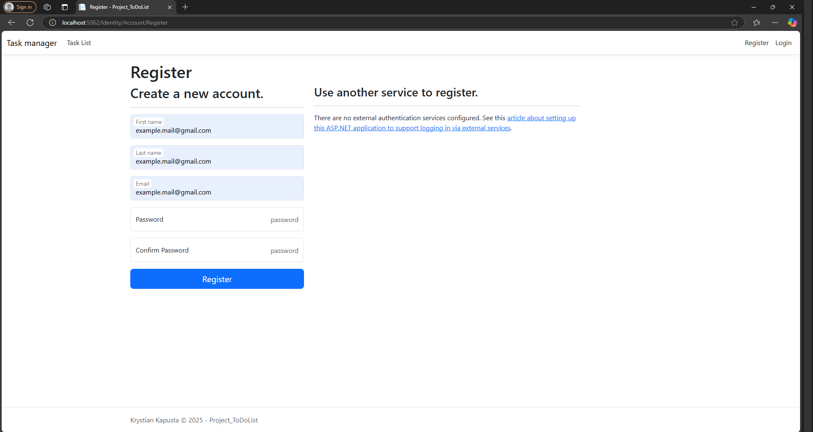
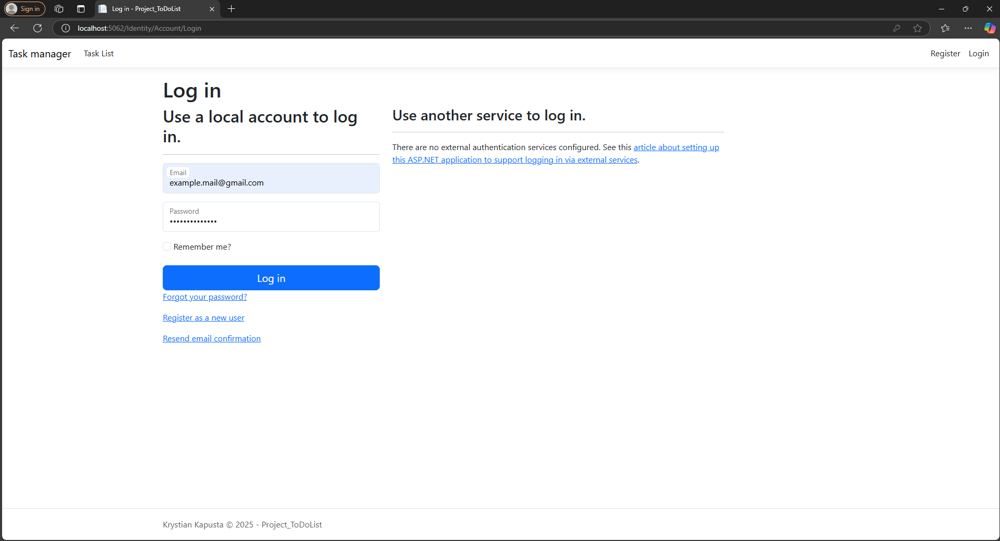
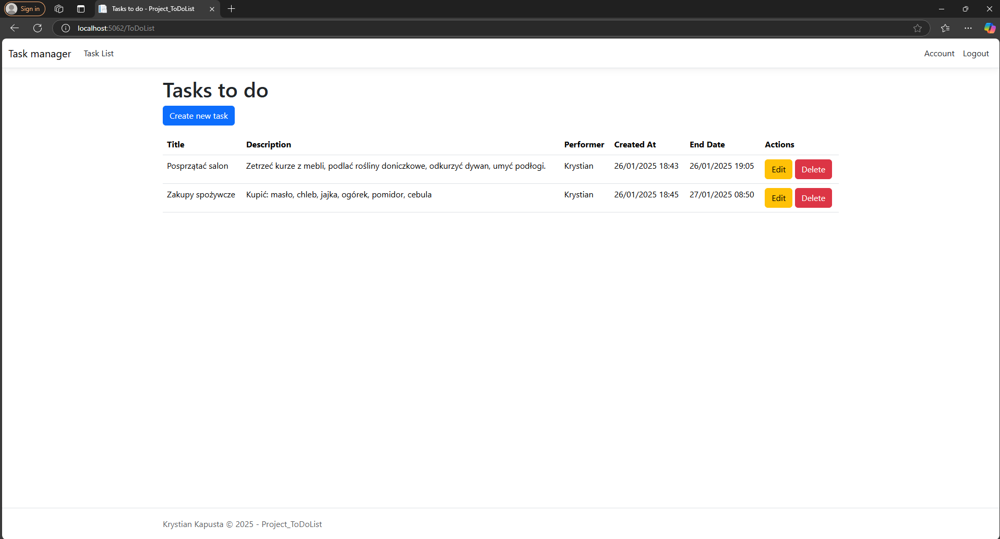
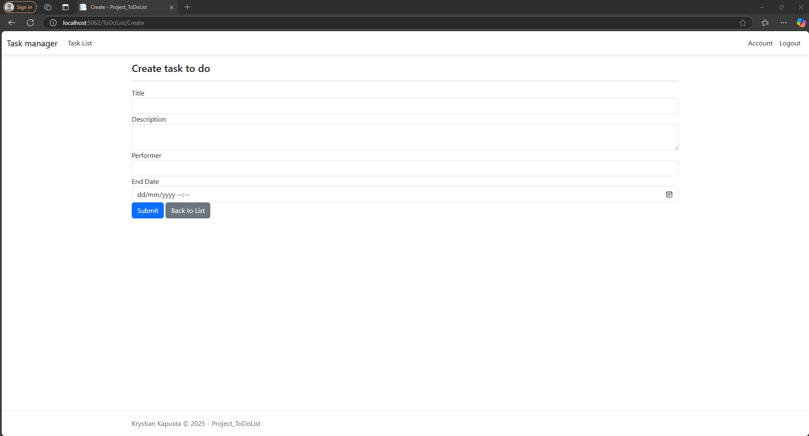
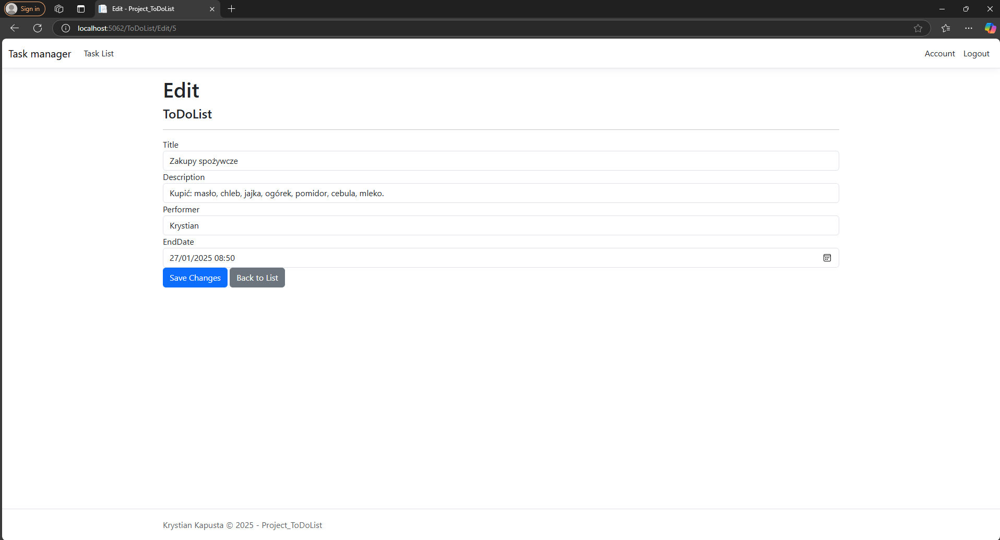
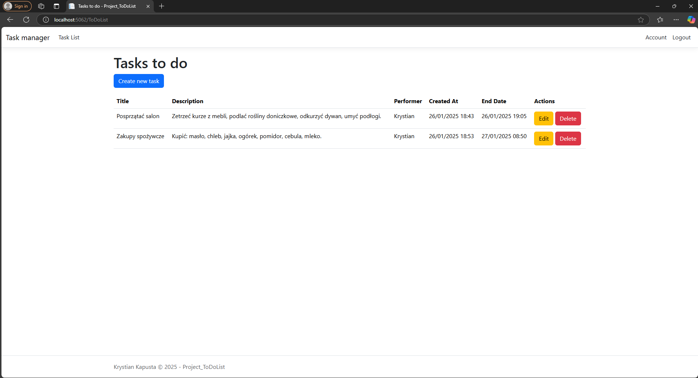
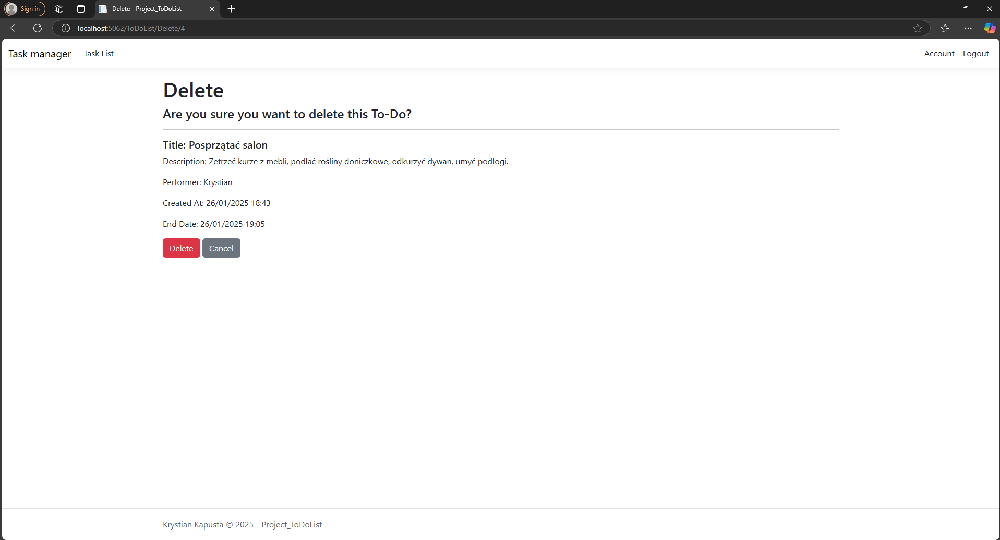
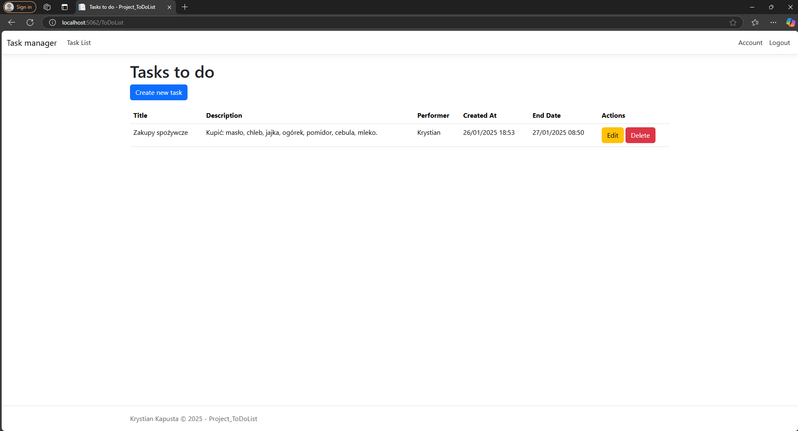

# Dokumentacja aplikacji Task manager

## Informacje o projekcie

Aplikacja "Task manager" została napisana w języku C# z użyciem technologii ASP.NET oraz bazy danych MS SQL.

## Funckjonalności
Rejestracja konta:

Logowanie:

Zarejestrowany użytkownik po uwczesnym zalogowaniu, ma możliwość wyświetlania listy zadań oraz może utworzyć nowe zadanie

Tworzenie nowego zadania:

Edycja utworzonego zadania:

Usuwanie zadania:

## Logika

Za obsługę rejestracji, logowania i ciasteczek odpowiada moduł "Identity". Wprowadzone dane logowania użytkowników są
przetrzymywane w bazie danych w tabeli "dbo.AspNetUsers".
Niezalogowany użytkownik nie ma dostępu do zarzadzania funkcjonalnościami aplikacji, gdyż wymuszana jest konieczność logowania.

Każde zadanie z listy jest tworzone przy pomocy modelu ToDoList.cs, gdzie wszystkie informacje są przetrzymywane w bazie danych
w tabeli: dbo.ToDoList. Za wyświetlanie danych, tworzenie, edycję bądź usuwanie zadania z bazy danych odpowiada
kontroler ToDoListController.cs

* Zawartość modelu [ToDoList.cs](Models/ToDoList.cs)
* Zawartość kontrolera [ToDoListController.cs](Controllers/ToDoListController.cs)
* Schemat bazy danych [Script.sql](Documentation/script.sql)
